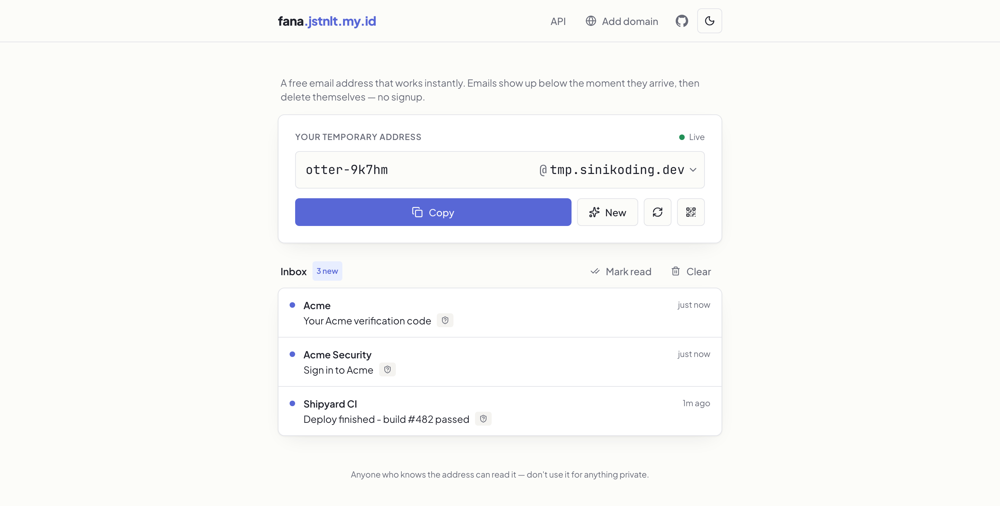
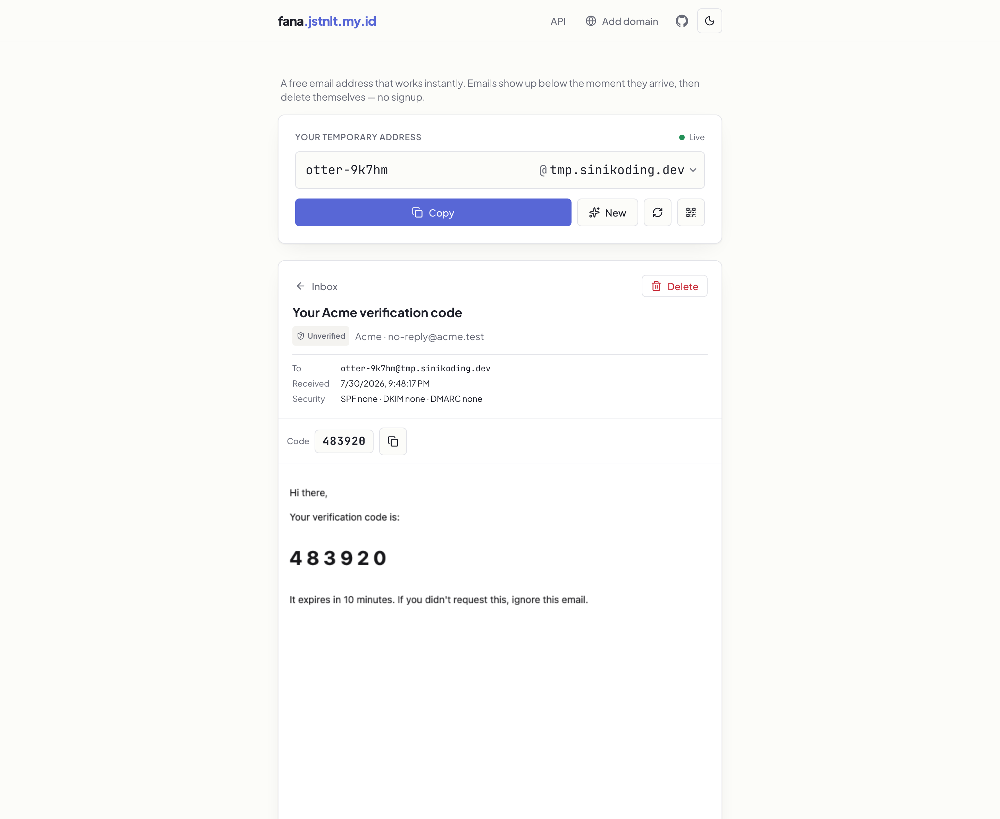
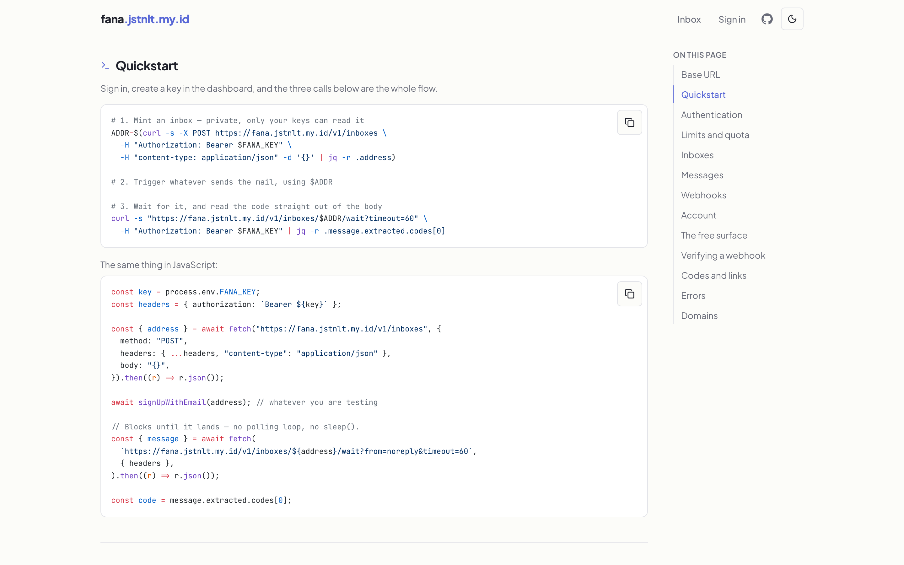

<div align="center">

# 📨 fana

**Self-hostable disposable email — with an API your tests can actually use.**

[](https://github.com/JastinXyz/fana/actions/workflows/ci.yml)
[](LICENSE)
[](tsconfig.base.json)

</div>

---

Give out a throwaway address, watch mail arrive live, let it vanish on a timer.
Then do the same thing from a test suite: create an inbox, trigger the signup,
**block until the mail lands**, and read the one-time code straight out of it.

```bash
ADDR=$(curl -s -X POST https://your-instance/v1/inboxes \
  -H "Authorization: Bearer $FANA_KEY" -d '{}' | jq -r .address)

# …trigger whatever sends the mail to $ADDR…

curl -s "https://your-instance/v1/inboxes/$ADDR/wait?timeout=60" \
  -H "Authorization: Bearer $FANA_KEY" | jq -r .message.extracted.codes[0]
# → 483920
```

No polling loop, no `sleep`, no parsing the body yourself.




## Why this one

- **Inboxes that are actually private.** Mail to an inbox minted through `/v1`
  is stamped with your account at ingestion. It never appears on the website,
  never reaches the public WebSocket, and answers `404` to anyone else — a
  guessable address is fine for a throwaway, not for a paying customer's tests.
- **`wait`, not poll.** One call holds open until a message matches `from`,
  `subject` or `since`. It costs one request no matter how long it waits.
- **The code and the link, extracted.** Reading a message returns the one-time
  code and the verification link, ranked by how close each candidate sits to a
  word naming it — not the first number in the body.
- **Webhooks** for callers that can't hold a connection: signed, retried with
  backoff, with every attempt and failure readable.
- **Yours end to end.** Your SMTP, your domain, your database. No vendor, and
  nothing phones home.



## Quick start

```bash
git clone https://github.com/JastinXyz/fana && cd fana
cp .env.example .env
docker compose up --build
```

- Web → http://localhost:3000
- API → http://localhost:4000/api/health
- API reference → http://localhost:3000/docs

Send it something without a real MX record, using
[swaks](https://github.com/jetmore/swaks):

```bash
swaks --to otter-9k7hm@example.com --server localhost:25 \
      --header "Subject: hello fana" --body "it works"
```

## Running it for real

**[docs/self-hosting.md](docs/self-hosting.md)** is the full walkthrough — two
domains, DNS, port 25, TLS, and the failures that don't look like failures.

The short version: point an MX record at your server, set `MAIL_DOMAINS` and
`SITE_ADDRESS` to **different** domains, and `docker compose up -d --build`.
Caddy terminates TLS and gets certificates on its own; nothing but the proxy and
SMTP is exposed.

| | |
| --- | --- |
| [Self-hosting](docs/self-hosting.md) | Deploy it, end to end |
| [Configuration](docs/configuration.md) | Every environment variable |
| [Operating](docs/admin.md) | Admin accounts, hiding the dashboard, the admin API |
| [Troubleshooting](docs/troubleshooting.md) | The quiet failure modes |

## The API

Two surfaces, deliberately.

`/api/*` is free and keyless — it's what the website runs on, and every inbox it
touches is public by design.

`/v1/*` is the one you hand to customers: an API key, a plan with quota and
retention, and private inboxes. Keys are self-serve once a customer signs in.

**Every instance serves its own reference at `/docs`**, stating that
deployment's base URL, its served domains and its plan limits — read from the
database, so it's right for a self-hoster instead of describing somebody else's
install.



## Branding

Site name, tagline, accent colour, logo and favicon are edited in the dashboard
and stored in the database, so a prebuilt image is rebranded without a rebuild.
One colour is enough: hover, tint and text-on-accent are derived from it in
OKLCH for both themes.

The GitHub link in the header points at this project and isn't themeable —
please keep the attribution if you self-host.

## Development

```bash
pnpm install
docker compose up postgres redis -d    # datastores only
cp .env.example .env
pnpm db:migrate
pnpm dev                               # smtp + api + web in watch mode
pnpm typecheck && pnpm lint && pnpm test
```

After changing `packages/db/src/schema.ts`, run `pnpm db:generate` and commit the
generated SQL. The API applies pending migrations on boot.

```
apps/
  smtp/   inbound SMTP → parse → authenticate → store → publish
  api/    REST + WebSocket, /v1, webhooks, admin, purge job
  web/    Next.js inbox, dashboard and API reference
packages/
  core/   pure logic: addresses, branding, extraction, webhook signing
  db/     Drizzle schema + migrations
  storage/  attachment blobs — Postgres or S3
infra/    Caddyfile
```

[AGENTS.md](AGENTS.md) documents the conventions and the reasoning behind them.
It is worth reading before a first PR.

## Contributing

PRs welcome — see [CONTRIBUTING.md](CONTRIBUTING.md). Security issues go through
[SECURITY.md](SECURITY.md), not the issue tracker.

[ROADMAP.md](ROADMAP.md) has what's planned, and what was deliberately dropped.

## License

[MIT](LICENSE)
